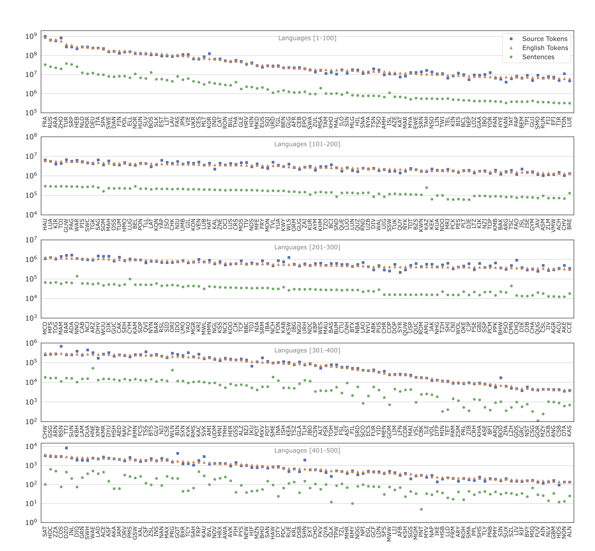

include::header.adoc[]

:doctype: article
:encoding: utf-8
:lang: en
:toclevels: 3
//:sectnums: false
// :sectnumlevels: 4
:data-uri:
:hide-uri-scheme:
:toc: left
//injects google analytics to <head>
:docinfo2:
:source-highlighter: highlight.js
:description: Many-to-English Data v1 Stats
:keywords: RTG, Translation, Machine Translation, NLP dataset, Low Resource Languages

==  Many-to-English: Data (v1)

Datasets are available at

* http://rtg.isi.edu/many-eng/data/v1/
* https://opus.nlpl.eu/MT560.php

[source,YAML]
----
train.raw.tsv.gz  # Training data in raw form, before cleaning, deduping and tokenization
train.v1.eng.tok.gz # English  training data, after cleaning and tokenization
train.v1.src.tok.gz # Source training data, after cleaning and tokenization
train.v1.lang.gz   # lang ID of source side sentences
train.v1.prov.gz   # provenance of record (to see where where this record)
train.v1.tok.stats.tsv # stats such as sentence and token count per language
devs-combo-shuf10k-raw+tok.tgz # 10K sentences for validation, randomly sampled from all dev sets
devtests-raw+tok.tgz  # all the dev and test data; both raw and tokenized
citations.bib  # BibTeX of articles which published the datasets collected in this work
prep.tgz  # scripts to prepare datasets from square 1.
----
`train.v1.{eng.tok,src.tok,lang,prov}` are plain text files after running gunzip.
They should have same number of lines. Line number is the way to cross-reference between them.

You may also prepare these datasets from scratch or revise cleaning mechanisms starting from `train.raw.tsv.gz`. The `prep.tgz` file has `datatprep.ipynb` notebook that contains steps to download, tokenize, deduplicate and filter our bad records.

.V1 Statistics (link:img/lang-stats-v1.pdf[Get PDF])

.Many-English V1 training data statistics (link:data-v1.tsv[Get TSV])
[%autowidth]
[cols=">,^,<,>,>,>", options="header",format="tsv"]
|===
include::data-v1.tsv[]
|===

== Acknowledgements

All the data consolidated in this work are retrieved from various sources and we do not own the dataset. If you use this dataset, please cite all the articles in `citations.bib` file.
We are enabling this derived dataset to be easily accessible, with the intention to accelerate the research of language technologies to low resource languages. However, if you view this derived dataset as a violation of intellectual property rights, please let us know, so we will be happy to remove it from the corpus.

