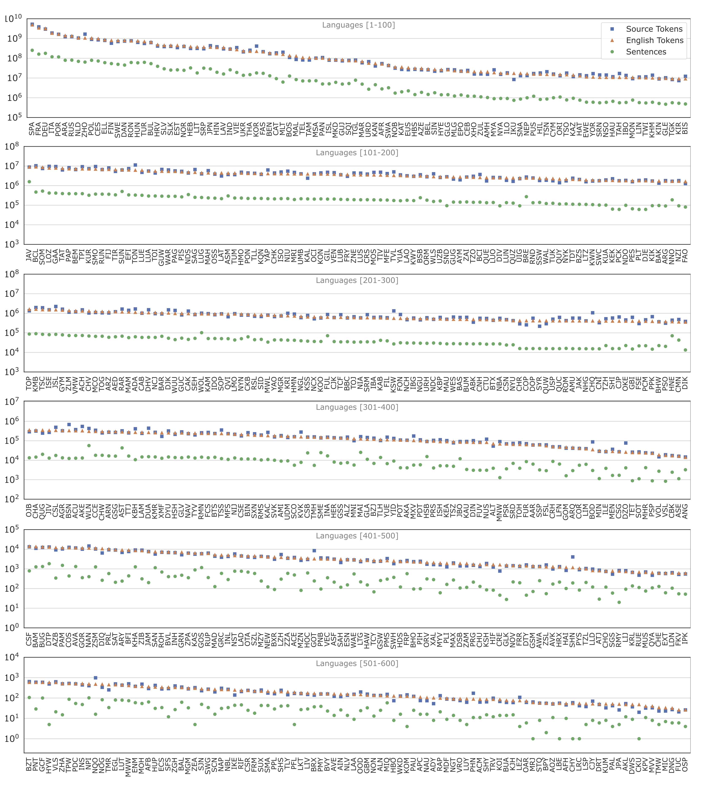

include::header.adoc[]

:doctype: article
:encoding: utf-8
:lang: en
:toclevels: 3
//:sectnums: false
// :sectnumlevels: 4
:data-uri:
:hide-uri-scheme:
:toc: left
//injects google analytics to <head>
:docinfo2:
:source-highlighter: rouge
:description: Many-to-English Data v1 Stats
:keywords: RTG, Translation, Machine Translation, NLP dataset, Low Resource Languages
:table-stripes: even

==  Many-to-English: Data v2 and Statistics

Due to license and copyright issues, we are unable to distribute the v2 data.
However, you may freshly download all data using `mtdata`:

[source, bash]
----
pip install mtdata==0.3.4
wget https://github.com/thammegowda/016-many-eng-v2/blob/2bf3e75ce/data/mtdata.recipes.yml
mtdata get-recipe -ri mul-eng-v2 -o mul-eng-v2
----
For dataset preparation, checkout instructions and scripts at
https://github.com/thammegowda/016-many-eng-v2/tree/main/data

.V1 Statistics (link:img/lang-stats-v2.pdf[Get PDF])

.Many-English dataset (v2) statistics
[cols=">,^,<,>,>,>", options="header",format=tsv,stripes=even]
|===
include::data-v2.tsv[]
|===

== Acknowledgements

