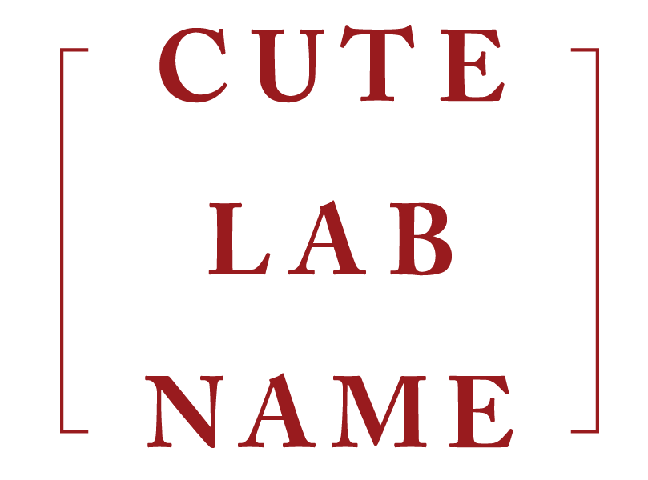

:linkcss:

[frame=none,grid=none,cols="2, 2,1,1,1,1"]
|===
| link:https://github.com/isi-nlp/[^] |link:index.html[Home] | link:v1[Demo v1] | link:v2[Demo v2] |  link:data-v1.html[Data v1] |  link:data-v2.html[Data v2]
|===
